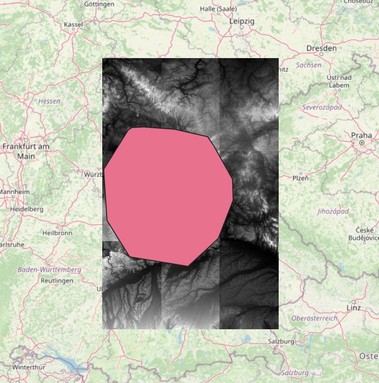

# EU DEM Download

Download DEM files of the EU.

Example:

Input was the rectangular bounding box `10.011636032586688,48.70792025947608,12.223993889052613,50.25793688217101` around the convex hull of all public transit stops of the VGN (pink). As result, nine DEM tiles were downloaded (black and white images) which cover the whole bounding box.



## Usage

To download DEM files covering a rectangular region of Europe (bounding box, consisting of four coordinates),
run  [./download_dem_zip.py](./download_dem_zip.py).

```
usage: download_dem_zip.py [-h] [--target-dir TARGET_DIRECTORY] BOUNDING_BOX

Download DEM tiles covering a bounding box from OpenDemEU with 1 arc second resolution. For details, see "1-arc second
European geographic tiles" at https://www.opendem.info/opendemeu_background.html

positional arguments:
  BOUNDING_BOX          Bounding Box

options:
  -h, --help            show this help message and exit
  --target-dir TARGET_DIRECTORY
                        Target directory where downloaded .zip files are stored
```

To extract the GeoTIFF (`.tif`) files and to create one JSON file with credits,
run [./extract_tif_and_credits.py](./extract_tif_and_credits.py).

```
usage: extract_tif_and_credits.py [-h] [--src-dir SOURCE_DIR] [--dst_dir TARGET_DIR]

Extract .tif files from .zip files of source directory into target directory and create one JSON file with credits of
the open data sources.

options:
  -h, --help            show this help message and exit
  --src-dir SOURCE_DIR  Source directory with .zip files
  --dst_dir TARGET_DIR  Target directory for extracted .tif files and credits.json
```

## Notes

### Definitions

Digital Surface Model (DSM), Digital Terrain Model (DTM): https://www.opendem.info/definitions.html

### Arc Seconds in Meters

https://www.opendem.info/arc2meters.html

### Open DEM EU - High Resolution

https://www.opendem.info/opendemeu_background.html

High-resolution projected tiles: In a 50*50 km raster as GeoTIFFs. The spatial reference system is the ETRS89 Lambert
Azimuthal Equal-Area projection coordinate reference system (EPSG:3035) and vertical datum EVRS2000 (EPSG:5730).
Resolutions below 1 m were recalculated to a 1 m DTM with a cubic resampling method to create manageable datasets below
10 GB.

- Download link example: http://opendemdata.info/data/europe_laea/N285E445.zip
- Square of four tiles: N290E440, N290E445, N285E440, N285E445

### Open DEM EU - Medium Resolution

https://www.opendem.info/opendemeu_background.html

1-arc second European geographic tiles: The typical SRTM style 1°*1° degree tiles with 1-arc second resolution as
GeoTIFFs. The spatial reference system is geographic, lat/lon with horizontal datum ETRS89, ellipsoid GRS80 (EPSG:4258)
and vertical datum EVRS2000 with geoid EGG08 (EPSG:5730).

- Download link example: https://www.muaythaiclinch.info/opendem_europe_download/eu_4258/N49E011.zip
- Square of four tiles: N49E010, N49E011, N50E010, N50E011

#### How to cite the selected Datasets:

- Produced using Copernicus data and information funded by the European Union - EU-DEM layers.
- Land NRW (2017) Data licence Germany – attribution – version 2.0 (www.govdata.de/dl-de/by-2-0)
- Agentschap voor Geografische Informatie Vlaanderen - CC0 1.0 Universal (CC0 1.0)
- Actueel Hoogtebestand Nederland (AHN) - CC0 1.0 Universal (CC0 1.0)
- Ministry of the environment and spatial planning, Slovenian environment agency (www.arso.gov.si)
- Geoland.at (2019) - CC BY 4.0 (CC BY 4.0)
- GEOPORTALE NAZIONALE - AccessConstraints: Nessuno - None

Have a look at the readme file of every tile for further information.
